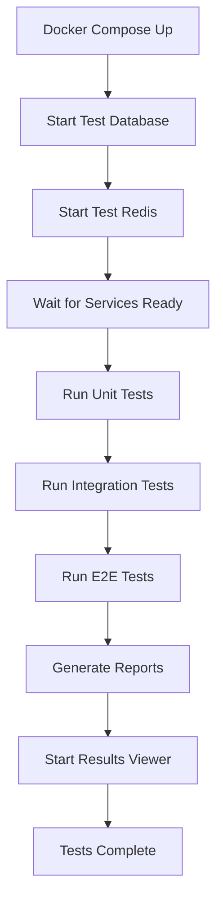

# 🐳 Docker Testing Framework

## **Comprehensive Docker-Based Testing for Car Insurance Backend**

This document describes the complete Docker testing setup that automatically runs tests when you spin up the service.

## 🚀 **Quick Start**

### **Run All Tests with Docker**
```bash
# Run all tests in Docker environment
npm run docker:test

# Or using docker-compose directly
docker-compose --profile test up --build
```

### **View Test Results**
```bash
# Start test results viewer
npm run docker:test:results

# View results at: http://localhost:8080
```

## 📋 **Available Docker Test Commands**

### **Main Testing Commands**
```bash
# Run all tests against main database
npm run docker:test

# Run comprehensive test suite with isolated test database
npm run docker:test:all

# View test results in browser
npm run docker:test:results

# Clean up all test containers and volumes
npm run docker:test:clean
```

### **Specific Test Types**
```bash
# Unit tests only
npm run docker:test:unit

# Integration tests only
npm run docker:test:integration

# E2E tests only
npm run docker:test:e2e

# Watch mode for development
npm run docker:test:watch
```

## 🏗️ **Docker Testing Architecture**

### **Two Testing Approaches**

#### **1. Main Database Testing** (`docker-compose.yml`)
- **Purpose**: Quick testing against main database
- **Use Case**: Development and basic CI
- **Command**: `npm run docker:test`
- **Database**: Uses main `car_insurance_db`

#### **2. Isolated Testing** (`docker-compose.test.yml`)
- **Purpose**: Complete isolation with dedicated test database
- **Use Case**: Production CI/CD and comprehensive testing
- **Command**: `npm run docker:test:all`
- **Database**: Uses isolated `car_insurance_test_db`

### **Service Architecture**

```
┌─────────────────┐    ┌─────────────────┐    ┌─────────────────┐
│   Test Runner   │    │  Test Database  │    │   Test Redis    │
│                 │    │                 │    │                 │
│ • Unit Tests    │◄──►│ PostgreSQL      │    │ Redis Cache     │
│ • Integration   │    │ Test DB         │    │ Test Instance   │
│ • E2E Tests     │    │ Auto Cleanup    │    │                 │
└─────────────────┘    └─────────────────┘    └─────────────────┘
         │                       │                       │
         ▼                       ▼                       ▼
┌─────────────────┐    ┌─────────────────┐    ┌─────────────────┐
│ Test Results    │    │   Application   │    │   Test Watch    │
│                 │    │                 │    │                 │
│ • HTML Reports  │    │ Main App for    │    │ Development     │
│ • Coverage      │    │ E2E Testing     │    │ Live Testing    │
│ • Nginx Server  │    │                 │    │                 │
└─────────────────┘    └─────────────────┘    └─────────────────┘
```

## 🐳 **Docker Services**

### **Test Database** (`test-db`)
```yaml
image: postgres:15-alpine
environment:
  POSTGRES_DB: car_insurance_test_db
  POSTGRES_USER: postgres
  POSTGRES_PASSWORD: testpassword
ports: ["5433:5432"]
```

### **Test Redis** (`test-redis`)
```yaml
image: redis:7-alpine
ports: ["6380:6379"]
```

### **Test Runner** (`test-runner`)
```yaml
build: Dockerfile.test
command: sh /app/scripts/run-all-tests.sh
volumes:
  - ./coverage:/app/coverage
  - ./test-results:/app/test-results
```

### **Test Results Viewer** (`test-results`)
```yaml
image: nginx:alpine
ports: ["8080:80"]
volumes:
  - ./coverage:/usr/share/nginx/html/coverage:ro
  - ./test-results:/usr/share/nginx/html/test-results:ro
```

## 📊 **Test Execution Flow**

### **Automatic Test Execution**


### **Test Orchestration Script**
The `scripts/run-all-tests.sh` script:
1. ✅ **Waits for database and Redis**
2. ✅ **Runs unit tests with coverage**
3. ✅ **Runs integration tests**
4. ✅ **Runs E2E tests (if app available)**
5. ✅ **Generates HTML and JSON reports**
6. ✅ **Provides comprehensive summary**

## 🎯 **Test Types in Docker**

### **1. Unit Tests**
- **Container**: `unit-tests`
- **Isolation**: No external dependencies
- **Speed**: Fast (< 2 seconds)
- **Coverage**: Comprehensive with thresholds

### **2. Integration Tests**
- **Container**: `integration-tests`
- **Dependencies**: Test database + Redis
- **Speed**: Medium (10-30 seconds)
- **Scope**: API endpoints + database

### **3. E2E Tests**
- **Container**: `e2e-tests`
- **Dependencies**: Full application stack
- **Speed**: Slower (30-60 seconds)
- **Scope**: Complete user workflows

### **4. Watch Mode**
- **Container**: `test-watch`
- **Purpose**: Development testing
- **Features**: Live reload, interactive

## 📈 **Test Results & Reports**

### **Automated Report Generation**
- **HTML Dashboard**: Complete test overview
- **Coverage Reports**: LCOV format with HTML viewer
- **JSON Summary**: Machine-readable results
- **Individual Test Logs**: Detailed failure information

### **Report Structure**
```
test-results/
├── index.html              # Main dashboard
├── test-summary.json       # JSON summary
├── unit-results.txt        # Unit test output
├── integration-results.txt # Integration test output
├── e2e-results.txt        # E2E test output
└── coverage/              # Coverage reports
    ├── lcov-report/       # HTML coverage
    └── lcov.info         # LCOV data
```

### **Accessing Reports**
```bash
# Start results viewer
npm run docker:test:results

# Open in browser
open http://localhost:8080

# Coverage reports
open http://localhost:8080/coverage/

# Raw test results
open http://localhost:8080/test-results/
```

## 🔧 **Configuration**

### **Environment Variables**
```bash
# Test Database
DATABASE_HOST=test-db
DATABASE_NAME=car_insurance_test_db
DATABASE_USERNAME=postgres
DATABASE_PASSWORD=testpassword

# Test Redis
REDIS_HOST=test-redis
REDIS_PORT=6379

# Test JWT
JWT_SECRET=test-jwt-secret-for-docker-testing
JWT_REFRESH_SECRET=test-refresh-secret-for-docker-testing
```

### **Docker Profiles**
```yaml
# Available profiles
profiles:
  - unit-tests      # Unit tests only
  - integration-tests # Integration tests only
  - e2e-tests       # E2E tests only
  - all-tests       # All test types
  - test-watch      # Development watch mode
  - test-results    # Results viewer only
```

## 🚀 **CI/CD Integration**

### **GitHub Actions Example**
```yaml
name: Docker Tests
on: [push, pull_request]

jobs:
  test:
    runs-on: ubuntu-latest
    steps:
      - uses: actions/checkout@v3
      - name: Run Docker Tests
        run: |
          npm run docker:test:all
          
      - name: Upload Coverage
        uses: codecov/codecov-action@v3
        with:
          file: ./coverage/lcov.info
```

### **Production Deployment Check**
```bash
# Pre-deployment test validation
npm run docker:test:all

# Check test results
if [ $? -eq 0 ]; then
  echo "✅ All tests passed - Ready for deployment"
  docker build -t car-insurance-backend:latest .
else
  echo "❌ Tests failed - Deployment blocked"
  exit 1
fi
```

## 🛠️ **Development Workflow**

### **Daily Development**
```bash
# Start development environment with testing
docker-compose --profile dev up -d

# Run tests in watch mode
npm run docker:test:watch

# View results continuously
npm run docker:test:results
```

### **Feature Development**
```bash
# 1. Start watch mode for TDD
npm run docker:test:watch

# 2. Develop feature with live testing
# ... code changes ...

# 3. Run full test suite before commit
npm run docker:test:all

# 4. Check coverage and results
open http://localhost:8080
```

### **Pre-Commit Validation**
```bash
# Complete validation pipeline
npm run docker:test:all && \
npm run lint && \
npm run build
```

## 🔍 **Troubleshooting**

### **Common Issues**

#### **Database Connection Issues**
```bash
# Check database status
docker-compose -f docker-compose.test.yml ps test-db

# View database logs
docker-compose -f docker-compose.test.yml logs test-db

# Manual database connection test
docker exec -it car-insurance-test-db psql -U postgres -d car_insurance_test_db
```

#### **Test Failures**
```bash
# View detailed test logs
docker-compose -f docker-compose.test.yml logs test-runner

# Check individual test results
cat test-results/unit-results.txt
cat test-results/integration-results.txt
```

#### **Port Conflicts**
```bash
# Check port usage
lsof -i :5433  # Test database
lsof -i :6380  # Test Redis
lsof -i :8080  # Test results viewer

# Stop conflicting services
npm run docker:test:clean
```

### **Performance Issues**
```bash
# Clean up Docker resources
docker system prune -f

# Rebuild test images
docker-compose -f docker-compose.test.yml build --no-cache

# Check resource usage
docker stats
```

## 📊 **Monitoring & Metrics**

### **Test Metrics Tracked**
- ✅ **Test Execution Time**
- ✅ **Coverage Percentages**
- ✅ **Success/Failure Rates**
- ✅ **Database Performance**
- ✅ **Memory Usage**

### **Health Checks**
- ✅ **Database Connectivity**
- ✅ **Redis Availability**
- ✅ **Application Startup**
- ✅ **Test Service Status**

## 🎯 **Best Practices**

### **Docker Testing Guidelines**
1. ✅ **Isolated Test Environment**
2. ✅ **Automatic Cleanup**
3. ✅ **Comprehensive Reporting**
4. ✅ **Fast Feedback Loop**
5. ✅ **CI/CD Integration**

### **Performance Optimization**
1. ✅ **Multi-stage Docker builds**
2. ✅ **Parallel test execution**
3. ✅ **Efficient resource usage**
4. ✅ **Smart caching strategies**

---

## 🎉 **Summary**

**The Docker testing framework provides:**

- 🐳 **Complete containerized testing environment**
- 🧪 **Automatic test execution on service startup**
- 📊 **Comprehensive reporting and coverage**
- 🔄 **CI/CD ready with multiple profiles**
- 🛠️ **Development-friendly watch modes**
- 📈 **Production-ready validation pipeline**

**Start testing immediately:**
```bash
npm run docker:test:all
open http://localhost:8080
```

**Your car insurance backend now has enterprise-grade Docker testing! 🚗🧪✨**
