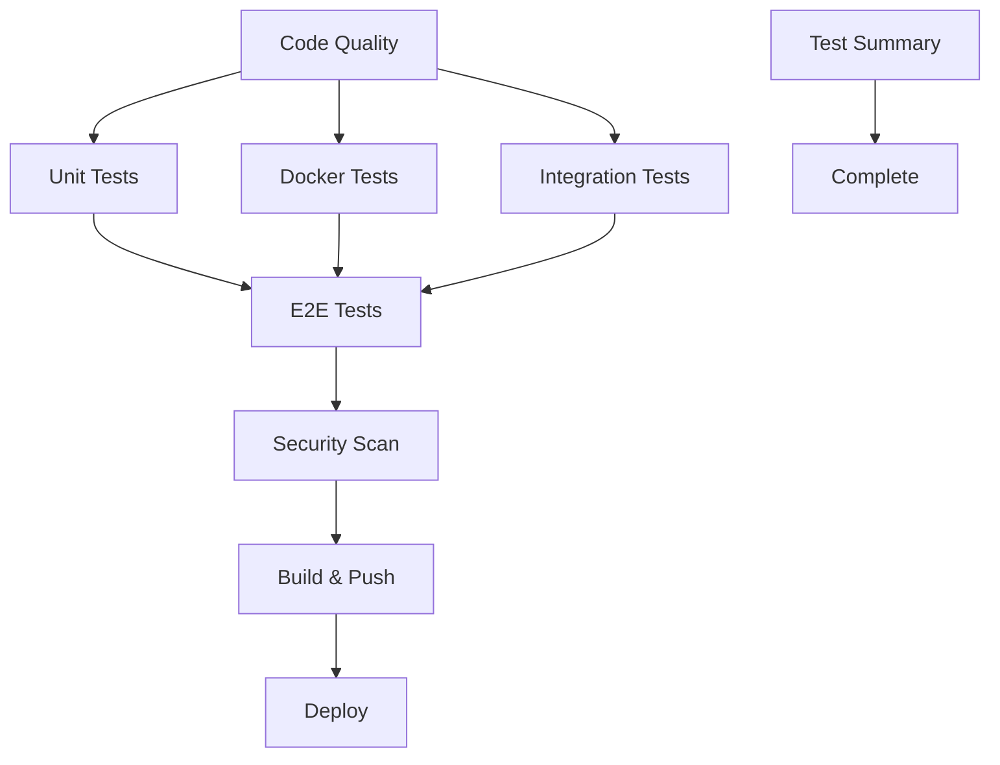

# 🚀 GitHub Actions CI/CD Pipeline

## **Comprehensive CI/CD for Car Insurance Backend**

This document describes the complete GitHub Actions setup that automatically builds, tests, and deploys the car insurance backend application.

## 🎯 **Overview**

Our CI/CD pipeline consists of 4 main workflows:

1. **🚗 Main CI/CD** (`ci.yml`) - Complete pipeline for main branch
2. **🔍 Pull Request Validation** (`pr.yml`) - Fast validation for PRs
3. **🚀 Manual Deployment** (`deploy.yml`) - On-demand deployments
4. **🔒 Security & Dependencies** (`security.yml`) - Security scanning and updates

## 📋 **Workflow Details**

### 1. **Main CI/CD Pipeline** (`ci.yml`)

**Triggers:**
- Push to `main` or `develop` branches
- Pull requests to `main` or `develop`
- Manual dispatch

**Jobs:**


#### **Job Breakdown:**

1. **🔍 Code Quality & Linting**
   - ESLint validation
   - TypeScript compilation
   - Build verification
   - Artifact upload

2. **🧪 Unit Tests**
   - Jest unit tests with coverage
   - Codecov integration
   - Coverage reports

3. **🐳 Docker Tests**
   - Matrix strategy: `unit-tests`, `integration-tests`
   - Docker build validation
   - Containerized test execution

4. **🔗 Integration Tests**
   - PostgreSQL and Redis services
   - Real database testing
   - Service dependency validation

5. **🎭 E2E Tests**
   - Full Docker Compose stack
   - Complete workflow testing
   - Real API interactions

6. **🔒 Security Scanning**
   - npm audit for dependencies
   - Trivy container scanning
   - SARIF upload to GitHub

7. **🏗️ Build & Push**
   - Multi-platform Docker builds
   - GitHub Container Registry
   - Automated tagging

8. **📊 Test Summary**
   - Comprehensive reporting
   - Artifact collection
   - GitHub Step Summary

9. **🚀 Deployment**
   - Production deployment (main branch only)
   - Environment-specific configs

### 2. **Pull Request Validation** (`pr.yml`)

**Triggers:**
- Pull request events (opened, synchronized, reopened)
- Draft PR exclusion

**Features:**
- **⚡ Quick Validation** - Fast linting and build checks
- **🐳 Docker Build Test** - Verify Docker builds work
- **🧪 Unit Tests** - Core functionality validation
- **🐳 Docker Compose Test** - Integration validation
- **📋 PR Summary** - Automated PR comments with results

**Smart Features:**
- **Change Detection** - Only runs tests when needed
- **Concurrency Control** - Cancels outdated runs
- **PR Comments** - Real-time feedback
- **Status Checks** - GitHub integration

### 3. **Manual Deployment** (`deploy.yml`)

**Triggers:**
- Manual workflow dispatch with parameters

**Parameters:**
- **Environment**: `staging` | `production`
- **Run Tests**: `true` | `false`
- **Docker Tag**: Custom tag (default: `latest`)

**Deployment Flow:**
```
Pre-deployment Tests → Docker Compose Test → Build & Push → Deploy → Smoke Tests
```

**Features:**
- **Environment Protection** - GitHub environment rules
- **Pre-deployment Validation** - Optional full test suite
- **Smoke Tests** - Post-deployment validation
- **Rollback Support** - Built-in rollback capabilities

### 4. **Security & Dependencies** (`security.yml`)

**Triggers:**
- Daily schedule (2 AM UTC)
- Dependency file changes
- Manual dispatch

**Security Features:**
- **🔍 Dependency Audit** - npm audit with vulnerability tracking
- **🐳 Docker Security Scan** - Trivy container scanning
- **🔍 Code Security Analysis** - GitHub CodeQL
- **🔄 Automated Updates** - Dependency update PRs

**Automated Actions:**
- **Issue Creation** - Auto-creates security issues
- **PR Creation** - Automated dependency update PRs
- **SARIF Upload** - Security findings to GitHub Security tab

## 🛠️ **Configuration**

### **Environment Variables**

```yaml
env:
  REGISTRY: ghcr.io
  IMAGE_NAME: ${{ github.repository }}
```

### **Secrets Required**

- `GITHUB_TOKEN` - Automatically provided
- Additional secrets for deployment environments

### **GitHub Environments**

1. **staging** - Staging environment protection
2. **production** - Production environment with approvals

## 📊 **Test Matrix**

### **Node.js Versions**
- Primary: Node.js 20
- Matrix testing available for multiple versions

### **Test Types**
- **Unit Tests** - Fast, isolated component testing
- **Integration Tests** - Database and service integration
- **E2E Tests** - Complete application workflows
- **Docker Tests** - Containerized testing

### **Platforms**
- **CI/CD**: Ubuntu Latest
- **Docker**: Multi-platform (linux/amd64, linux/arm64)

## 🚀 **Usage Examples**

### **Automatic Triggers**

```bash
# Trigger full CI/CD pipeline
git push origin main

# Trigger PR validation
git push origin feature-branch
gh pr create --title "New feature" --body "Description"
```

### **Manual Triggers**

```bash
# Manual deployment to staging
gh workflow run deploy.yml \
  -f environment=staging \
  -f run_tests=true \
  -f docker_tag=latest

# Manual security scan
gh workflow run security.yml
```

### **Monitoring**

```bash
# Check workflow status
gh run list --workflow=ci.yml

# View specific run
gh run view <run-id>

# Download artifacts
gh run download <run-id>
```

## 📈 **Reporting & Monitoring**

### **Test Reports**
- **Coverage Reports** - Codecov integration
- **Test Results** - JUnit XML format
- **Artifacts** - Downloadable test results

### **Security Reports**
- **GitHub Security Tab** - SARIF integration
- **Dependency Alerts** - Automated issue creation
- **Container Scanning** - Trivy results

### **Deployment Reports**
- **GitHub Deployments** - Environment tracking
- **Step Summaries** - Rich markdown reports
- **Artifact Tracking** - Docker image versions

## 🔧 **Customization**

### **Adding New Tests**

1. **Unit Tests**
   ```yaml
   - name: 🧪 New test type
     run: npm run test:new-type
   ```

2. **Integration Tests**
   ```yaml
   services:
     new-service:
       image: new-service:latest
       ports:
         - 8080:8080
   ```

### **Environment Configuration**

1. **Add New Environment**
   ```yaml
   deploy-new-env:
     environment: new-environment
     if: inputs.environment == 'new-environment'
   ```

2. **Custom Deployment Steps**
   ```yaml
   - name: 🚀 Deploy to new environment
     run: |
       echo "Custom deployment logic"
   ```

### **Security Customization**

1. **Additional Scanners**
   ```yaml
   - name: 🔍 Custom security scan
     uses: custom/security-action@v1
   ```

2. **Custom Audit Levels**
   ```yaml
   - name: 🔒 Strict audit
     run: npm audit --audit-level=low
   ```

## 🎯 **Best Practices**

### **Performance Optimization**
- ✅ **Parallel Jobs** - Maximum concurrency
- ✅ **Caching** - Docker layer and npm caching
- ✅ **Conditional Execution** - Skip unnecessary steps
- ✅ **Artifact Management** - Efficient storage

### **Security**
- ✅ **Least Privilege** - Minimal permissions
- ✅ **Secret Management** - GitHub Secrets
- ✅ **Environment Protection** - Required approvals
- ✅ **Audit Logging** - Complete traceability

### **Reliability**
- ✅ **Health Checks** - Service readiness validation
- ✅ **Retry Logic** - Automatic retry on failures
- ✅ **Timeout Management** - Prevent hanging jobs
- ✅ **Cleanup** - Resource cleanup after jobs

## 📋 **Workflow Status**

### **Current Implementation**

| Workflow | Status | Features |
|----------|--------|----------|
| **Main CI/CD** | ✅ Complete | Full pipeline with 9 jobs |
| **PR Validation** | ✅ Complete | Fast validation with smart detection |
| **Manual Deployment** | ✅ Complete | Multi-environment with parameters |
| **Security Scanning** | ✅ Complete | Automated security and updates |

### **Integration Status**

| Integration | Status | Description |
|-------------|--------|-------------|
| **Docker** | ✅ Active | Multi-stage builds and testing |
| **Codecov** | ✅ Active | Coverage reporting |
| **GitHub Security** | ✅ Active | SARIF upload and alerts |
| **Container Registry** | ✅ Active | GHCR integration |

## 🚀 **Getting Started**

### **1. Enable Workflows**
```bash
# Workflows are automatically enabled when pushed to GitHub
git add .github/workflows/
git commit -m "feat: Add comprehensive CI/CD pipeline"
git push origin main
```

### **2. Configure Environments**
1. Go to repository Settings → Environments
2. Create `staging` and `production` environments
3. Configure protection rules and secrets

### **3. Set Up Branch Protection**
1. Go to Settings → Branches
2. Add protection rules for `main` branch
3. Require status checks from workflows

### **4. Monitor First Run**
1. Check Actions tab for workflow execution
2. Review test results and artifacts
3. Verify Docker images in Packages tab

## 🎉 **Benefits**

### **Development**
- 🚀 **Fast Feedback** - Quick PR validation
- 🔄 **Automated Testing** - Comprehensive test coverage
- 📊 **Rich Reporting** - Detailed test and coverage reports
- 🛡️ **Quality Gates** - Prevent broken code from merging

### **Operations**
- 🐳 **Containerized** - Consistent environments
- 🔒 **Secure** - Automated security scanning
- 📈 **Scalable** - Multi-platform builds
- 🎯 **Reliable** - Robust error handling

### **Security**
- 🔍 **Continuous Scanning** - Daily security checks
- 🔄 **Automated Updates** - Dependency management
- 📊 **Visibility** - Security dashboard integration
- 🚨 **Alerting** - Automated issue creation

---

## 🎯 **Summary**

**Your car insurance backend now has enterprise-grade CI/CD with:**

- ✅ **Complete automation** on every push
- ✅ **Comprehensive testing** (unit, integration, e2e)
- ✅ **Docker integration** with multi-stage builds
- ✅ **Security scanning** and dependency management
- ✅ **Multi-environment deployment** with protection
- ✅ **Rich reporting** and monitoring

**The pipeline ensures that every code change is:**
- 🧪 **Thoroughly tested**
- 🔒 **Security validated**
- 🐳 **Docker ready**
- 🚀 **Deployment ready**

**Start using immediately:**
```bash
git push origin main
# Watch the magic happen in GitHub Actions! ✨
```
